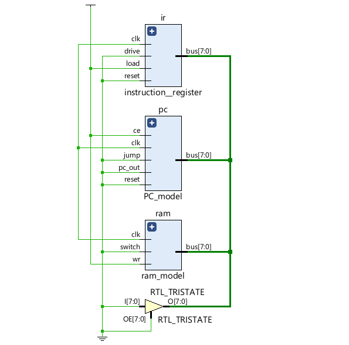
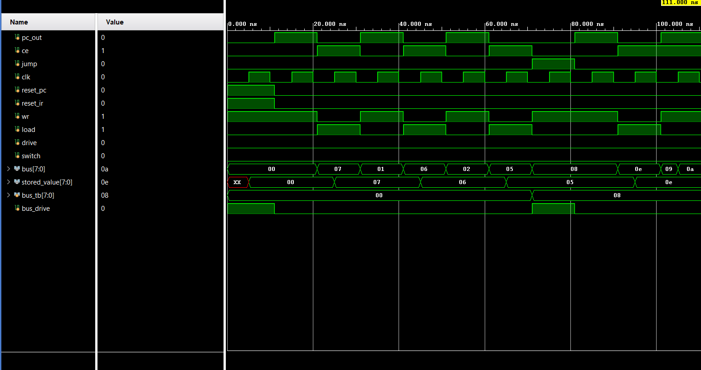

# Instruction Register
Made an Instruction Register which captures the data  that was passed to the bus by RAM and then stores it for as long as needed , designed and implemented in AMD Xilinx Vivado.

## Modules
|**Module Name**|**Function**|
| :--- | :--- |
|Instruction-Register|`instruction_register` captures the data  that was passed to the bus by RAM and then stores it for as long as needed.|
|Program-Counter|`pc_model`increments the 4-bit address by 1 bit each time the count_enable function is on.It gives instruction to the RAM as to which memory element is currently needed.|
|RAM-Model|`ram_model` is a 16x8-bit synchronous memory storage RAM which enables us to store 16 elements of 1 byte (8bits) each.|

## Operations Allowed
|**Operations**|**Symbol**|**Function**|
| :--- | :--- | :--- |
|Load|`load`| Reads the value from the bus which was passed by RAM and stores it |
|Drive|`drive`| Writes the value on the bus when needed for operations such as by ALU |
|Reset|`reset`| Resets the value stored in IR to 8'b0000_0000. |

## Schematic :
### Schematic:

## Simulations :

